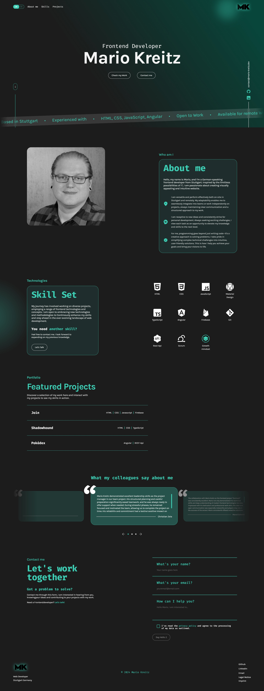

# 🌟 Portfolio

Welcome to my personal portfolio, built with **Angular 19**. This website showcases my web development skills, highlights my projects, and provides a glimpse into my professional background. The design is responsive, interactive, and easy to navigate.

## 🚀 Features

- **Hero Section**  
  A dynamic hero section with CTA buttons:  
  - "Check my work" – Takes you to my projects.
  - "Contact me" – Leads to the contact form.
  
- **About Me Section**  
  A brief overview of who I am, my experience, and my journey in web development.

- **Skills Section**  
  A showcase of the tools and technologies I specialize in.

- **Project Section**  
  A collection of my projects, each with a popup modal for more detailed information.

- **Testimonial Carousel**  
  An animated carousel featuring testimonials from clients and colleagues.

- **Contact Form**  
  A form allowing visitors to get in touch with me, powered by a PHP backend to process submissions.

- **Imprint & Privacy Policy**  
  Links available in the footer for legal and privacy-related information.

## 🛠️ Technologies Used

- **Angular 19**
- **TypeScript**
- **SCSS**
- **Angular CLI**
- **PHP** (for backend of the contact form)

## 📜 License

This project is licensed under the **MIT License**.

## 📸 Screenshots

